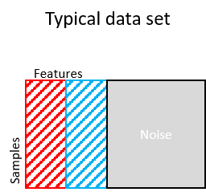

survClust vignette
================

## Installation

``` r
library(devtools)
install_github("arorarshi/survClust")
```

## Requirements

*survClust* requires the following packages - `stats,survival, pdist,
plyr and Rcpp`

## Introduction

*survClust* is an outcome weighted supervised clustering algorithm,
designed to classify patients according to their molecular as well as
time-event or end point of interest. Until now, sub-typing in cancer
biology has relied heavily upon clustering/mining of molecular data
alone. We present classification of samples on molecular data supervised
by time-event data like Overall Survival (OS), Progression Free Survival
etc.

Below is the workflow of proposed *survClust* method:

1.  `getDist` - Compute a weighted distance matrix across given `m` data
    types. Standardization and accounting for non-overlapping samples is
    also accomplished in this step.

2.  `combineDist`- Integrate `m` data types by averaging over `m`
    weighted distance matrices.

3.  `survClust` and `cv.survclust` - cluster integrated weighted
    distance matrices via `survClust`. Optimal `k` is estimated via
    cross-validation using `cv.survclust`. Cross-validated results are
    assessed over the following performance metrics - the logrank
    statistic, standardized pooled within-cluster sum of squares and
    cluster solutions with class size less than 5 samples.

Note: `cv.survclust` is a wrapper function that will cross-validate and
output cluster assignments. If you run without cross validation and just
the commands on its own **getDist**, **combineDist** and **survClust**,
you are over-fitting\!

## Simulation Example

We wish to simulate the structure as discussed in the manuscript. Where,
a typical biological dataset has some features related to survival and
molecular distinct, some unrelated to survival but molecular distinct
and remaining as noise. We will enforce a 3-class structure. See code
below.



``` r

######################
#simulation to test survival related + survival unrelated
#total samples = 150, total features = 150

set.seed(112)
n1 = 50 #class1
n2 = 50 #class2
n3 = 50 #class3
n = n1+n2+n3
p = 15 #survival related features (10%)
q = 120 #noise

#class1 ~ N(1.5,1), class2 ~ N(0,1), class3 ~ N(-1.5,1)

rnames = paste0("S",1:n)
x = NULL
x1a = matrix(rnorm(n1*p, 1.5, 1), ncol=p)
x2a = matrix(rnorm(n1*p), ncol=p)
x3a = matrix(rnorm(n1*p, -1.5,1), ncol=p)
xa = rbind(x1a,x2a,x3a)
xb = matrix(rnorm(n*q), ncol=q)
x[[1]] = cbind(xa,xb)

     
################
# sample 30 other informant features, but scramble them.
permute.idx<-sample(1:length(rnames),length(rnames))
#-'ve HR
x1a = matrix(rnorm(n1*p, 1.5, 1), ncol=p)
x2a = matrix(rnorm(n1*p), ncol=p)
x3a = matrix(rnorm(n1*p, -1.5,1), ncol=p)
xa = rbind(x1a,x2a,x3a)

x[[1]] = cbind(x[[1]],xa[permute.idx,])
rownames(x[[1]]) =  rnames

#true class labels
truth = c(rep(1,50), rep(2,50), rep(3,50)); names(truth) = rnames
```

Next we simulate a overall survival dataset with 3 groups with median
survival time as 2yrs, 3yrs and 4yrs respectively.

``` r


set.seed(112)
l1 = log(2)/4.5
l2 = log(2)/3.25
l3 = log(2)/2
n = 50

s1<-rexp(n,rate=l1)
c1<-runif(n,0,10)
s2<-rexp(n,rate=l2)
c2<-runif(n,0,10)
s3<-rexp(n,rate=l3)
c3<-runif(n,0,10)

t1 = pmin(s1,c1)
t2 = pmin(s2,c2)
t3 = pmin(s3,c3)

event = c((t1==s1),(t2==s2),(t3==s3))
time = c(t1,t2,t3)
survdat = cbind(time, event)
rownames(survdat) = rnames
#survfit(Surv(time,event) ~ truth)
plot(survfit(Surv(time,event) ~ truth), lty=1:3, mark.time=T, bty="l",lwd=1.5, main="simulated survival dataset")
```


Then we can run `cv.survclust` from k=2-5 for 10 rounds of 3-fold cross
validation to see how we perform.

``` r

registerDoParallel(cores=4)
cvrounds<-function(x,survdat,kk){
    this.fold=3
    fit<-list()
    for (i in 1:10){
        fit[[i]] = cv.survclust(x, survdat,kk,this.fold)
        print(paste0("finished for", i," round CV"))
    }
    return(fit)
}

ptm <- proc.time()
cv.fit<-foreach(kk=2:5) %dopar% cvrounds(x,survdat,kk)
```

## getDist

``` r

dd = getDist(x,survdat)
```

## combineDist

``` r

cc = combineDist(dd)
```
